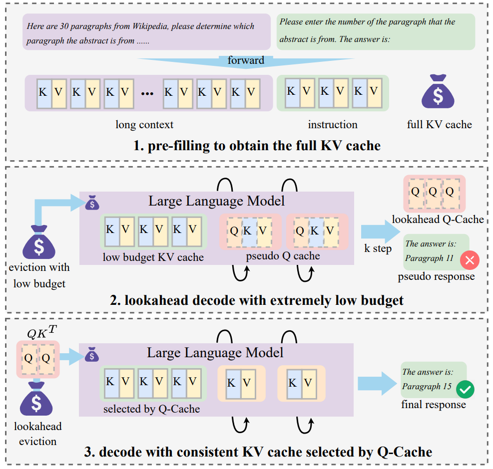

# Lookahead Q-Cache: Achieving More Consistent KV Cache Eviction via Pseudo Query [EMNLP 2025]


This is the repo for our EMNLP 2025 paper:
[Lookahead Q-Cache: Achieving More Consistent KV Cache Eviction via Pseudo Query](https://arxiv.org/abs/2505.20334)


<p align="center">
  
</p>
In this paper, we propose Lookahead Q-Cache (LAQ),
a novel eviction framework that generates lowcost pseudo lookahead queries to better approximate the true decoding-stage queries. Experimental results on LongBench and Needlein-a-Haystack benchmarks show that LAQ outperforms existing methods across various budget levels, achieving a 1 ∼ 4 point improvement on LongBench under limited cache budget.

## Acknowledgement

Our codebase is built upon **[KVCache-Factory](https://github.com/Zefan-Cai/KVCache-Factory)**.  
We sincerely thank the authors for providing open-source code to support this project.  


## Installation

```bash

git clone git@github.com:noforit/Lookahead_Q-Cache.git
cd Lookahead_Q-Cache
conda create -n LAQ python=3.12
conda activate LAQ
pip install -r requirements.txt .

```
## LongBench

You can obtain the results of LAQ on LongBench by referring to the `run_LAQ.sh` and modifying the corresponding parameters.

```bash
# run_LAQ.sh
export CUDA_VISIBLE_DEVICES=0
method=LAQ # Support LAQ
max_capacity_prompts=128 # 128 256 512 
attn_implementation=flash_attention_2 # Support "flash_attention_2"
model_path=/your/path/to/Mistral-7B-Instruct-v0.2
save_dir=results/
lookahead_max_capacity_prompts="${max_capacity_prompts}"
lookahead_method=snapkv # snapkv in paper, but LAQ is orthogonal to methods such as SnapKV and PyramidKV.
lookahead_window_size=32 # This window_size is used for the lookahead_method.
max_lookahead_size=8
stage2_window_size=8 # This window_size is used in the decoding stage, and it is set to 0 for LAQ, 8 for LAQ.
datasets="narrativeqa qasper multifieldqa_en hotpotqa 2wikimqa musique gov_report qmsum multi_news trec triviaqa samsum passage_count passage_retrieval_en lcc repobench-p"

python3 run_longbench_LAQ.py \
    --method ${method} \
    --model_path ${model_path} \
    --max_capacity_prompts ${max_capacity_prompts} \
    --attn_implementation ${attn_implementation} \
    --save_dir ${save_dir} \
    --use_cache True \
    --lookahead_max_capacity_prompts ${lookahead_max_capacity_prompts} \
    --lookahead_method ${lookahead_method} \
    --max_lookahead_size ${max_lookahead_size} \
    --lookahead_window_size ${lookahead_window_size} \
    --stage2_window_size ${stage2_window_size} \
    --datasets ${datasets}


model_name=$(basename "$model_path" | tr '[:upper:]' '[:lower:]')

eval_path="${save_dir}/${model_name}_${max_capacity_prompts}"
python3 eval.py --results_dir ${eval_path}
echo "eval_path: $eval_path"
```


## Needle in haystack


```bash
# run_needle.sh
export CUDA_VISIBLE_DEVICES=0
method=LAQ # Support PyramidKV, SnapKV, H2O, StreamingLLM
model_provider=Mistral # Support LLaMA3, Mistral, qwen2
max_capacity_prompts=96
attn_implementation=flash_attention_2
model_path=/your/path/to/Mistral-7B-Instruct-v0.2
lookahead_method=snapkv
max_lookahead_size=8
window_size=32 # for LAQ, this window_size is used in the lookahead stage, and it is usually set to 32.
stage2_window_size=8


TAG=test
mkdir -p results_needle/logs
(
python -u run_needle_in_haystack.py --s_len 800 --e_len 32001 \
    --model_provider ${model_provider} \
    --model_name ${model_path} \
    --attn_implementation ${attn_implementation} \
    --step 800 \
    --method $method \
    --max_capacity_prompt $max_capacity_prompts \
    --model_version ${model_provider}_${method}_${max_capacity_prompts}_${TAG} \
    --lookahead_method ${lookahead_method} \
    --max_lookahead_size ${max_lookahead_size} \
    --window_size ${window_size} \
    --stage2_window_size ${stage2_window_size}

) 2>&1  | tee results_needle/logs/${model_provider}_${method}_${max_capacity_prompts}_${TAG}.log
```

After inference, run

`python scripts/scripts_needle/visualize.py`

to draw the img, you should change `FOLDER_PATH` in `visualize.py` to your output path.


## Citation

If you find **Lookahead Q-Cache** useful for your research and applications, please kindly cite using this BibTeX:

```latex
@article{wang2025lookahead,
  title={Lookahead Q-Cache: Achieving More Consistent KV Cache Eviction via Pseudo Query},
  author={Wang, Yixuan and Ji, Shiyu and Liu, Yijun and Xu, Yuzhuang and Xu, Yang and Zhu, Qingfu and Che, Wanxiang},
  journal={arXiv preprint arXiv:2505.20334},
  year={2025}
}
```

